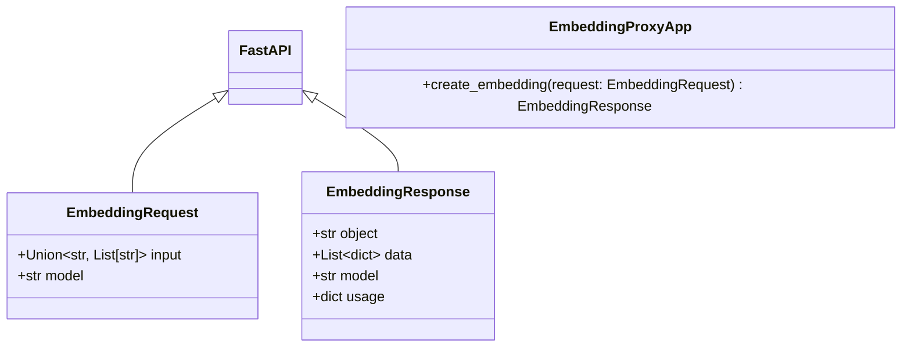
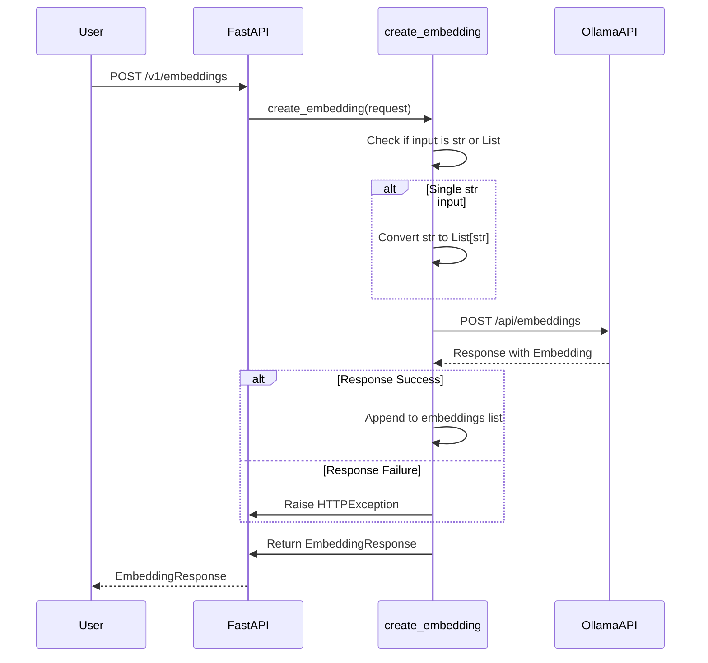
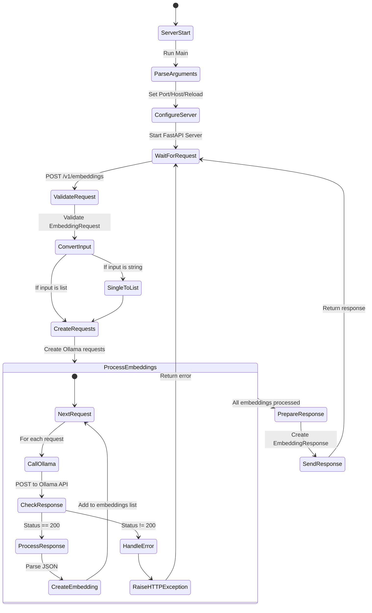

# Enable Ollama Embeddings for GraphRAG

## Problem

GraphRAG is designed to work with OpenAI-compatible APIs for both language models and embeddings and Ollama currently has their own way of doing embeddings.

## Solution: Embeddings Proxy

To bridge this gap, let's use an embeddings proxy. This proxy acts as a middleware between GraphRAG and Ollama, translating Ollama's embedding responses into a format that GraphRAG expects.

## Design
### Class Diagram

### Sequence Diagram

### Activity Diagram

